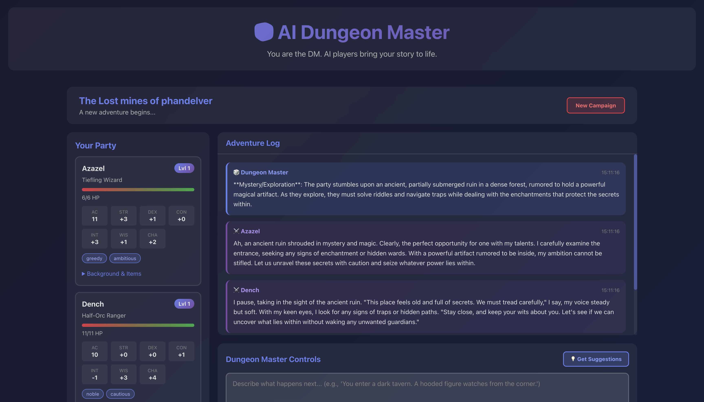
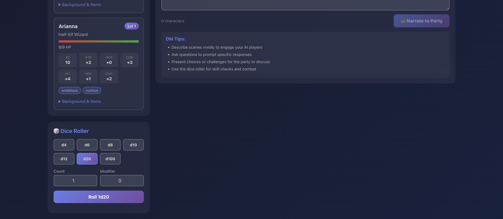

# AI Dungeon Master - Inverted Edition

An innovative D&D experience where **YOU are the Dungeon Master** and AI-powered players bring your adventures to life!




## Concept

Unlike traditional AI D&D games where AI is the DM, this flips the script:
- **Human Player**: Acts as the Dungeon Master, creating stories and scenarios
- **AI Players**: Generate unique characters and roleplay as your party members
- **Dynamic Interaction**: AI players discuss, debate, and make decisions like real players

## Features

- 🎭 **AI-Generated Characters**: Automatically creates balanced party with distinct personalities
- 💬 **Realistic Roleplay**: AI players interact with each other and respond naturally
- 🎲 **Full D&D Mechanics**: Dice rolling, combat, skill checks, character progression
- 🤖 **DM Assistant**: Get AI-powered scenario suggestions to enhance your storytelling
- 💾 **Session Persistence**: Save and continue your campaigns
- 🐳 **Docker Ready**: Easy setup with Docker Compose

## Tech Stack

- **Frontend**: React with modern UI
- **Backend**: FastAPI (Python)
- **Database**: PostgreSQL
- **AI**: OpenAI GPT-4o (configurable via environment variable)
- **Deployment**: Docker Compose

## Quick Start

```bash
# Clone and setup
cd ai-dungeon-master

# Start with Docker
docker-compose up

# Access the game
# Frontend: http://localhost:3000
# API: http://localhost:8000
```

## Project Structure

```
ai-dungeon-master/
├── frontend/          # React application
├── backend/           # FastAPI server
├── docker-compose.yml # Docker configuration
└── README.md
```

## How to Play

1. **Setup**: Choose your party size (3-5 AI players recommended)
2. **Character Generation**: AI creates unique characters with personalities
3. **Adventure**: Describe scenes and situations as the DM
4. **AI Response**: Watch your AI party discuss and make decisions
5. **Resolution**: Roll dice, resolve actions, progress the story

## Development

The project uses Docker for all development. Backend code changes are hot-reloaded automatically.

```bash
# View logs
docker-compose logs -f

# Rebuild after dependency changes
docker-compose up --build

# Access backend shell
docker-compose exec backend bash
```

## Environment Variables

Create a `.env` file in the **root directory** (required for Docker):

```bash
# Required
OPENAI_API_KEY=your_openai_api_key_here

# Optional (defaults to gpt-4o)
OPENAI_MODEL=gpt-4o
# Available models: gpt-5, gpt-5-mini, gpt-4o, gpt-4o-mini, gpt-4-turbo, gpt-3.5-turbo
```

See `.env.example` for reference.

## License

MIT

## Contributing

This is a personal project, but suggestions and ideas are welcome!
